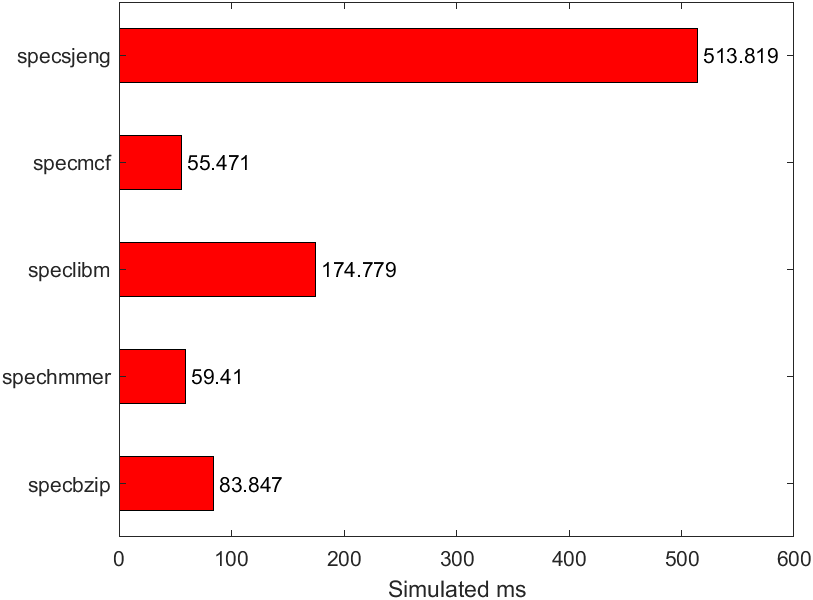
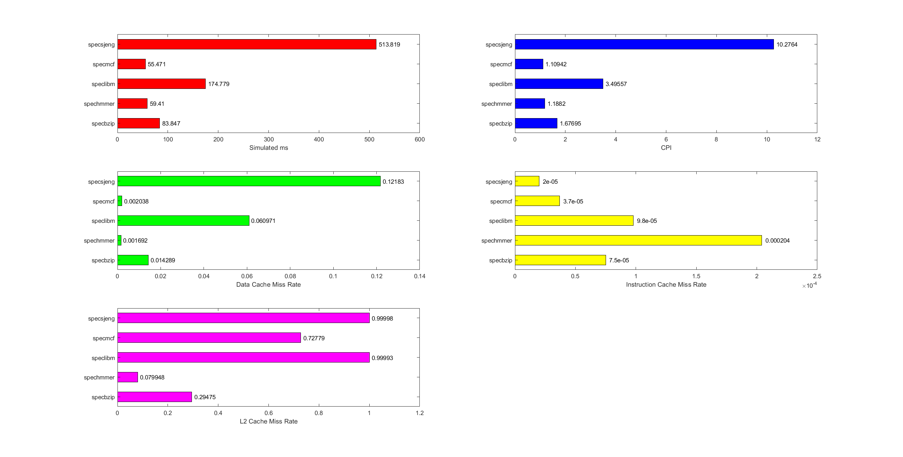
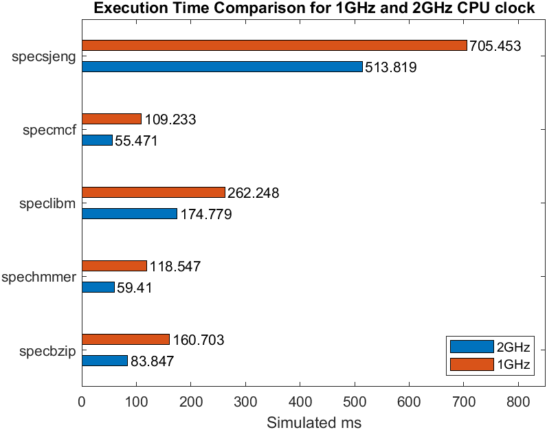
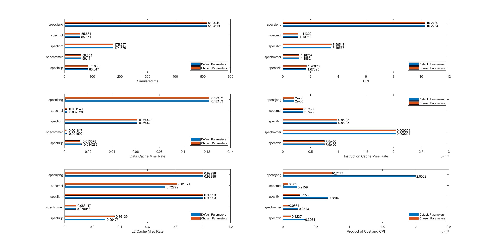

# Computer Architecture

## Lab 2
04/12/2020\
Ilia Zarka 9289\
Iosif Chrysostomou 9130

---

### 1st Step
#### 1. System parameters

We run the benchmarks on this step with a **cache line size** of `64B`, a 2 way set associative **data cache** with a size of `64kB`, a 2 way set associative **instruction cache** with a size of `32kB` and an 8 way set associative **L2 cache** with a size of `2MB`.

#### 2. Simulation statistics

 

#### 3. Different clock domains

In both cases, the system runs at `2GHz` (system.clk_domain). This clock is used to synchronize everything on the motherboard. The cpu_clk_domain clock refers to the cpu clock. That clock is by default, multiple of the system clock. So a second cpu, would run at a multiple of `1GHz`.

| | Simulated ms | CPI | Data Cache Miss Rate | Instruction Cache Miss Rate | L2 Cache Miss Rate |
| --- | :---: | :---: | :---: | :---: |:---: |
| specbzip | 160.703 | 1.607035 | 0.014133 | 0.000076 | 0.294739 | 
| spechmmer | 118.547 | 1.185466 | 0.001684 | 0.000204 | 0.079949 |
| speclibm | 262.248 | 2.622476 | 0.060971 | 0.000098 | 0.999927 |
| specmcf | 109.233 | 1.09233 | 0.002038 | 0.000037 | 0.727788 |
| specsjeng | 705.453 | 7.054533 | 0.121829 | 0.000020 | 0.999979 |

The simulated seconds do not scale with the clock frequency. This was also apparent on the first lab where we run our code with a wider variety of frequencies. The reason is that some stages of the execution of a command, do not depend only on the cpu frequency. A couple of those stages are reading and writing on the memory. The memory transfers rates are not tied to the cpu frequency, which means there can be delays which are independent from the rest of the system.

### 2nd Step

#### 1. Selecting variations to emulate
As we have learnt from the lessons, having more than 1-way associativity greatly increases performance by avoiding memory conflicts, but also has diminishing returns at larger values. This is the reason we chose to simulate 2, 4 and 8-way associativities. Also, Cache Line Size has a rather negetive impact on the performance when small values are used, however very large values increase the implementation cost (based on Step 3).

#### 2. Results of the selected simulations
* [Cache Line Size](./cls.md)
* [Data Cache Size and Associativity](./dcache.md)
* [Instruction Cache Size and Associativity](./icache.md)
* [L2 Cache Size and Associativity](./l2.md)

### 3rd Step

For calculating the cost, we had a few key criteria in our minds.

* First, the cost of every memory level scales linearly with its size.
* Then, the higher level memories with the same characteristics (size, associativity etc) are cheaper to manufacture. In this case, we assumed that the L2 cache is 20% cheaper than the L1 cache.
* Increasing the associativity should also increase the cost, but not linearly. As we saw in the lectures, increasing the associativity, has diminishing returns. More specifically, more than an 8 way associative memory, shows very little improvements in performance. We made an educated guess and chose a logarithmic increase in the overall cost from the increase in assosiativity.
* Lastly, cash line size should also play a role in the final cost. We choose to multiply the above cost with the line size, because it affects both memory levels, and it increases the complexity of the hole cpu.

So we came up with the following formula

`cost = (InstCacheSize * log(InstCacheAssoc) + DataCacheSize * log(DataCacheAssoc) + 0.5 * L2Size * log(L2Assoc)) * log(CacheLineSize)`

| **Cache Line Size** | 32kB  |  64kB | 128kB |
|:-------------------:|:-----:|:-----:|:-----:|
|       **cost**      | 4.44M | 5.33M | 6.22M |

From the simulations we run, it looks like increasing the cache line size, benefits only certain workloads. Out of our five benchmarks, only **specjeng** and **speclibm** showed a significant decrease in the simulated ms. 

| **Data Cache** | 32kB 2-way | 64kB 2-way | 128kB 2-way | 32kB 4-way | 64kB 4-way | 128kB 4-way |
|:--------------:|:----------:|:----------:|:-----------:|:----------:|:----------:|:-----------:|
|    **cost**    |    5.25M   |    5.568M  |    6.16M    |    5.39M   |    5.84M   |    6.73M    |

Changing the Data cache configurations showed minimal improvements in performance across the board, with only the **specbzip** benchmark having a measurable difference in the simulated ms.

| **Instr. Cache** | 32kB 2-way  | 64kB 2-way | 128kB 2-way | 32kB 4-way | 64kB 4-way | 128kB 4-way |
|:----------------:|:-----------:|:----------:|:-----------:|:----------:|:----------:|:-----------:|
|     **cost**     |    5.44M    |    5.75M   |     6.36M   |    5.58M   |    6.03M   |    6.92M    |

The benefits of changing the Instruction caches size and associativity are basically zero in every benchmark we tried.

|  **L2 Cache**    | 512kB 4-way | 1MB 4-way | 2MB 4-way | 4MB 4-way | 512kB 8-way | 1MB 8-way | 2MB 8-way | 4MB 8-way |
|:----------------:|:-----------:|:---------:|:---------:|:---------:|:-----------:|:---------:|:---------:|:---------:|
|     **cost**     |    4.14M    |   7.54M   |   14.5M   |   28.44M  |    5.45M    |   10.09M  |   19.6M   |   38.61M  |

L2 cache shows a similar trend to the other two memories we tried tweaking. Most of the benchmarks had little to no improvements except **specbzip**, which had an decrease in the simulated ms of about 5%.\

Considering our knowledge and our results from the benchmarks we run, we concluded that the optimum configurations are the following:
* 64B Cache line size
* 64kB 4 way associative Data cache
* 32kB 2 way associative Instr. Cache
* 1MB 4 way associative L2 cache

| | Default Parameters | Chosen Parameters |
|:---:|:---:|:---:|
| **cost** | 19.464.192 | 7.274.496 |

The performance of the 2 configurations is displayed in the graph below. The final subplot indicates the **Price-to-Performance Ratio**, in this case in the form of `cost * cpi` where less is better.

